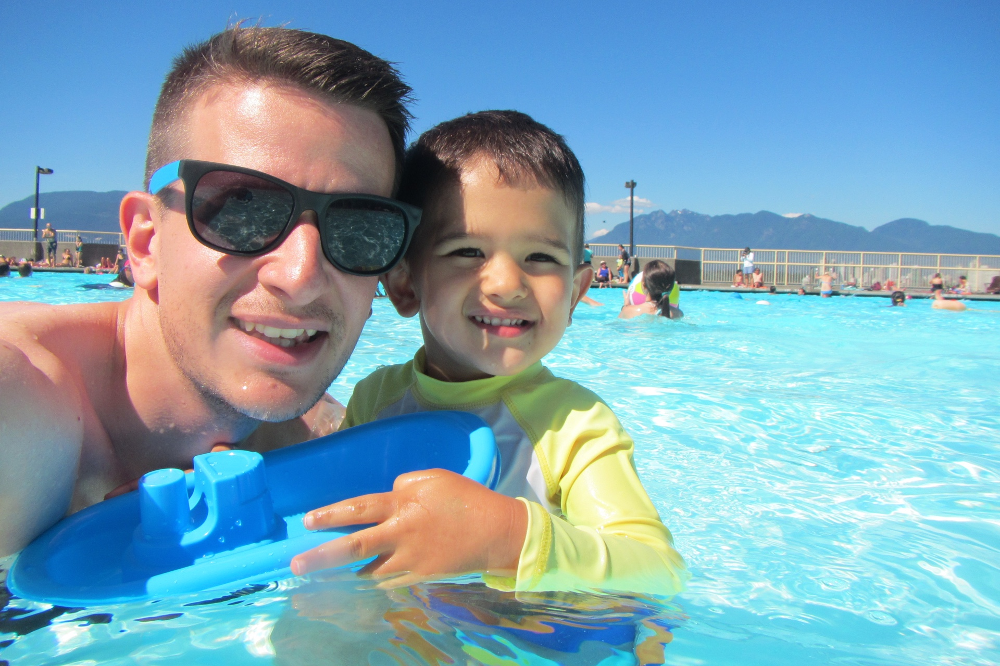

## I'm Derek.

I'm a husband to the best wife and a dad to the best son, and I do a lot of things.

## I make web.

The full stack, from backend to UX. I like using all sorts of technologies, and specialized in [Drupal](/things/drupal-blog) once, solving the challenges of [delivering 900 individual sites](https://dewy.io). Now I love to use a [JAM stack](https://jamstack.org), or when a traditional CMS is still the only thing that will make a client sleep at night, [SilverStripe](https://www.silverstripe.org/blog/site-of-the-month-alberta-electric-system-operator/). I had a lead role building the University of Calgary's web experience, now I'm pushing digital forward with the brilliant minds at [Evans Hunt](http://www.evanshunt.com) as a technology lead.

* [LinkedIn](http://www.linkedin.com/in/derekmcburney)
* [GitHub](https://github.com/dmcb)

## I take photographs.

Okay, everyone takes photographs. But I've been absolutely privileged to be able to take photos for *other* people. Though my family will always be my favourite subjects. [Check out my work](http://photographybyderek.com), and [the blog](http://photographybyderek.com/blog/).

* [500px](http://500px.com/derekmcb)
* [Instagram](http://instagram.com/derekmcburney)

## I care about community.

When I get a chance, [I blog about civic issues](http://calgaryurbanite.com), which regrettably is not very often. I [co-founded a non-profit once](http://myworldmychoice.org). We ran a school program to teach students about economic, social and environmental sustainability. It was awesome, the kids were amazing.

## etc.

* [Twitter](https://twitter.com/derekmcb) - My outlet for political diatribes, borderline is offensive comedy and mindless ranting. It's not pretty. Don't go here. Unless you want to reach out to me. Then totally go here.
* [Strava](http://www.strava.com/athletes/derekmcb) - Soccer destroyed my knee. I do cycling now.
* [last.fm](http://www.last.fm/user/dmcb) - I ♥ music.
